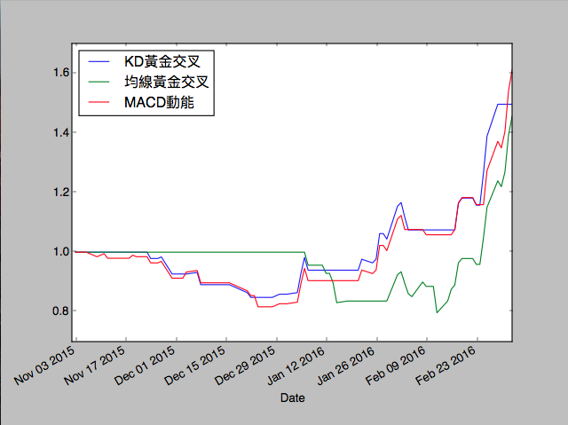

股市技術分析小工具
======================
對於目前在python好像還沒找到一個適合作為股市技術分析的套件，所以決定先刻一份簡單的工具頂著用。   
目前已新增簡易的波段回測投報率線圖，參考自[幣圖誌](http://www.bituzi.com/2014/12/Rbacktest6mins.html)



套件需求
======================
matplotlib >= 1.5.1   
pandas >= 0.18.0   
pandas-datareader >= 0.2.0   

使用說明
======================
* 安裝程式請直接使用 pip
  ```sh
  pip install finance4py
  ```
  
* 基本技術線圖的取得請參考範例程式 example.py（on [Github](https://github.com/m10215059/finance4py)）
  ```sh
  python example.py
  ```

* 回測程式部分可自行定義以下函式處理自己的策略並交給回測程式處理即可
  ```python
  def strategy(today, today_data, stock):
      return
  ```
  詳情請參考範例程式 example_backtesting.py（on [Github](https://github.com/m10215059/finance4py)）
  ```sh
  python example_backtesting.py   
  ```

授權協議 BSD License
======================
Copyright (c) 2016, finance4py team   
All rights reserved.   

Redistribution and use in source and binary forms, with or without modification, are permitted provided that the following conditions are met:   

1. Redistributions of source code must retain the above copyright notice, this list of conditions and the following disclaimer.   
2. Redistributions in binary form must reproduce the above copyright notice, this list of conditions and the following disclaimer in the documentation and/or other materials provided with the distribution.   
3. Neither the name of the copyright holder nor the names of its contributors may be used to endorse or promote products derived from this software without specific prior written permission.   

THIS SOFTWARE IS PROVIDED BY THE COPYRIGHT HOLDERS AND CONTRIBUTORS "AS IS" AND ANY EXPRESS OR IMPLIED WARRANTIES, INCLUDING, BUT NOT LIMITED TO, THE IMPLIED WARRANTIES OF MERCHANTABILITY AND FITNESS FOR A PARTICULAR PURPOSE ARE DISCLAIMED. IN NO EVENT SHALL THE COPYRIGHT HOLDER OR CONTRIBUTORS BE LIABLE FOR ANY DIRECT, INDIRECT, INCIDENTAL, SPECIAL, EXEMPLARY, OR CONSEQUENTIAL DAMAGES (INCLUDING, BUT NOT LIMITED TO, PROCUREMENT OF SUBSTITUTE GOODS OR SERVICES; LOSS OF USE, DATA, OR PROFITS; OR BUSINESS INTERRUPTION) HOWEVER CAUSED AND ON ANY THEORY OF LIABILITY, WHETHER IN CONTRACT, STRICT LIABILITY, OR TORT (INCLUDING NEGLIGENCE OR OTHERWISE) ARISING IN ANY WAY OUT OF THE USE OF THIS SOFTWARE, EVEN IF ADVISED OF THE POSSIBILITY OF SUCH DAMAGE.